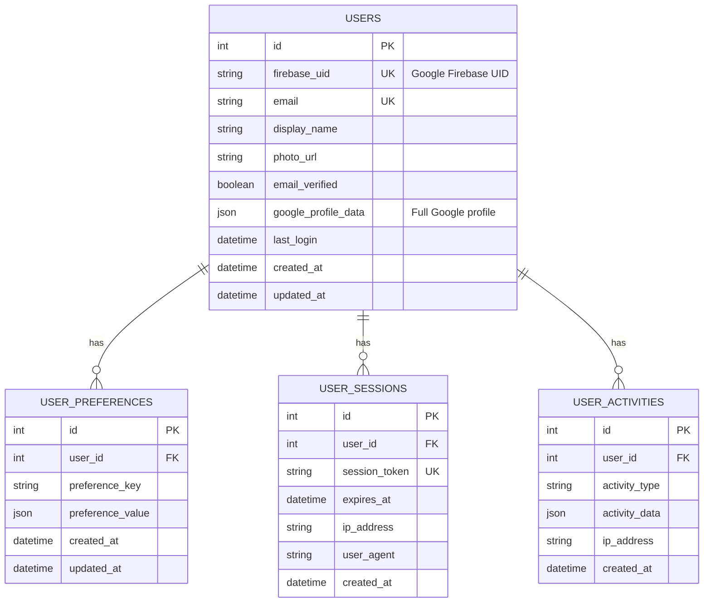

# 🏗️ User Database Implementation Plan

## 📋 System Overview

This plan implements a comprehensive user management system that integrates Google OAuth with a FastAPI backend database, while the frontend remains hosted on GitHub Pages as static files.

### Architecture Diagram


## 🎯 Implementation Components

### 1. Backend Database Schema

#### User Model
- **firebase_uid**: Unique Google Firebase UID (Primary identifier)
- **email**: User email address (Unique)
- **display_name**: User's display name
- **photo_url**: Profile picture URL
- **email_verified**: Email verification status
- **google_profile_data**: Complete Google profile as JSON
- **last_login**: Track user activity
- **created_at/updated_at**: Timestamps

#### User Preferences Model
- **user_id**: Foreign key to User
- **preference_key**: Setting name (theme, language, etc.)
- **preference_value**: Setting value as JSON
- **timestamps**

#### User Sessions Model
- **user_id**: Foreign key to User
- **session_token**: JWT token for authentication
- **expires_at**: Session expiration
- **ip_address**: Client IP for security
- **user_agent**: Browser/device info
- **created_at**: Session start time

#### User Activities Model
- **user_id**: Foreign key to User
- **activity_type**: Type of activity (login, preference_change, etc.)
- **activity_data**: Activity details as JSON
- **ip_address**: Client IP
- **created_at**: Activity timestamp

### 2. Backend API Endpoints

#### User Management
- `POST /api/v1/users` - Create/update user from Google OAuth data
- `GET /api/v1/users/{user_id}` - Get user by ID
- `GET /api/v1/users/me` - Get current authenticated user
- `PUT /api/v1/users/{user_id}` - Update user profile

#### User Preferences
- `GET /api/v1/users/{user_id}/preferences` - Get user preferences
- `PUT /api/v1/users/{user_id}/preferences` - Update user preferences
- `POST /api/v1/users/{user_id}/preferences` - Set specific preference

#### Authentication & Sessions
- `POST /api/v1/auth/session` - Create user session (login)
- `GET /api/v1/auth/session/validate` - Validate current session
- `DELETE /api/v1/auth/session` - End user session (logout)

#### Activity Tracking
- `GET /api/v1/users/{user_id}/activity` - Get user activity history
- `POST /api/v1/users/{user_id}/activity` - Log user activity

### 3. Frontend Integration (GitHub Pages Compatible)

#### API Configuration
- Environment-based backend URL configuration
- Development: `http://localhost:7070`
- Production: `https://api.elysapp.io`
- CORS handling for cross-origin requests

#### Enhanced Authentication Flow
1. User clicks "Sign in with Google"
2. Firebase handles Google OAuth
3. Frontend receives Google user data
4. Frontend POSTs user data to backend `/api/v1/users`
5. Backend creates/updates user record
6. Backend returns session token
7. Frontend stores session for API calls

#### New Frontend Services
- **UserService**: HTTP client for backend communication
- **SessionService**: Manage user sessions and tokens
- **PreferencesService**: Handle user preferences

### 4. Database Schema Design



## 🔧 Technical Implementation Details

### Backend Changes Required

#### 1. New Dependencies (pyproject.toml)
```toml
python-jose = "^3.3.0"  # JWT handling
passlib = "^1.7.4"      # Password utilities
python-multipart = "^0.0.6"  # Form data handling
```

#### 2. New Models
- `app/models/user.py` - User model with Google OAuth fields
- `app/models/user_preferences.py` - User preferences model
- `app/models/user_session.py` - Session management model
- `app/models/user_activity.py` - Activity tracking model

#### 3. New API Endpoints
- `app/api/users.py` - User management endpoints
- `app/api/auth.py` - Authentication and session endpoints
- `app/api/preferences.py` - User preferences endpoints

#### 4. Authentication Middleware
- JWT token validation
- User context injection
- Session management

#### 5. Database Migrations
- Alembic migration scripts for new tables
- Proper indexing for performance
- Foreign key constraints

### Frontend Changes Required

#### 1. Environment Configuration
```javascript
// src/lib/config.js
export const API_BASE_URL = import.meta.env.VITE_API_BASE_URL || 'http://localhost:7070';
```

#### 2. API Service Layer
```javascript
// src/lib/api.js
class ApiService {
  async createUser(googleUser) { /* POST to /api/v1/users */ }
  async getUser(userId) { /* GET from /api/v1/users/{id} */ }
  async updatePreferences(userId, preferences) { /* PUT to /api/v1/users/{id}/preferences */ }
}
```

#### 3. Enhanced Auth Store
```javascript
// src/stores/auth.js - Extended
export const backendUser = writable(null);
export const sessionToken = writable(null);
export const userPreferences = writable({});
```

#### 4. Updated Authentication Flow
- Modify `signInWithGoogle()` to call backend
- Add session token management
- Add user preferences loading

### Configuration Updates

#### Backend Environment (.env)
```bash
# JWT Configuration
JWT_SECRET_KEY=your-secret-key-here
JWT_ALGORITHM=HS256
JWT_ACCESS_TOKEN_EXPIRE_MINUTES=1440

# CORS Configuration
CORS_ORIGINS=https://yourusername.github.io,http://localhost:5173
```

#### Frontend Environment (.env.local)
```bash
# Backend API Configuration
VITE_API_BASE_URL=http://localhost:7070
# Production: VITE_API_BASE_URL=https://api.elysapp.io
```

## 🚀 Implementation Steps

### Phase 1: Backend Database & Models
1. Add new dependencies to pyproject.toml
2. Create user-related models
3. Generate Alembic migrations
4. Apply database schema changes

### Phase 2: Backend API Endpoints
1. Implement user management endpoints
2. Add authentication middleware
3. Create session management
4. Add activity tracking

### Phase 3: Frontend Integration
1. Add API configuration
2. Create backend service layer
3. Update authentication flow
4. Add user preferences handling

### Phase 4: Testing & Deployment
1. Test complete authentication flow
2. Verify CORS configuration
3. Test with GitHub Pages deployment
4. Configure production backend URL

## 🔒 Security Considerations

### Authentication Security
- **JWT Tokens**: Secure session management with expiration
- **CORS Configuration**: Restrict to authorized domains only
- **Input Validation**: Comprehensive validation on all endpoints
- **Rate Limiting**: Protect against API abuse

### Data Privacy
- **Minimal Data Storage**: Store only necessary Google OAuth data
- (not now, will do in the future). **Data Encryption**: Sensitive data encrypted at rest
- (not now, will do in the future). **GDPR Compliance**: User data deletion capabilities
- **Audit Trail**: Activity tracking for security monitoring

### GitHub Pages Considerations
- **HTTPS Only**: All API calls over HTTPS
- **Environment Variables**: Secure configuration management
- **Client-Side Security**: No sensitive data in frontend code
- **Session Management**: Secure token storage in browser

## 📱 Android App Integration Ready

The implemented system will provide:

### User Context
- **User ID**: Consistent identifier across platforms
- **Profile Data**: Synchronized user information
- **Preferences**: Cross-platform settings sync

### API Endpoints
- **RESTful API**: Standard HTTP endpoints for mobile integration
- **Session Management**: Token-based authentication
- **Activity Tracking**: User behavior analytics

### Data Consistency
- **Single Source of Truth**: Centralized user database
- **Real-time Sync**: Immediate preference updates
- **Offline Support**: Local caching capabilities

## 🎯 Success Criteria

### Functional Requirements
- ✅ Users can sign in with Google OAuth
- ✅ User data automatically saved to backend database
- ✅ User preferences stored and retrievable
- ✅ Session management working
- ✅ Activity tracking implemented
- ✅ GitHub Pages deployment compatible

### Technical Requirements
- ✅ Secure JWT-based authentication
- ✅ Proper CORS configuration
- ✅ Database migrations working
- ✅ API endpoints documented
- ✅ Error handling implemented
- ✅ Ready for Android integration

## 📋 Next Steps After Implementation

1. **Production Deployment**: Deploy backend to production server
2. **Domain Configuration**: Set up api.elysapp.io
3. **SSL Certificate**: Ensure HTTPS for production API
4. **Monitoring**: Add logging and monitoring
5. **Android Integration**: Use established API endpoints
6. **Analytics**: Implement user behavior tracking
7. **Backup Strategy**: Database backup procedures

---

**Note**: This plan maintains the static GitHub Pages hosting while adding a robust backend user management system. The frontend will make cross-origin API calls to the backend, which is a standard architecture for static site + API applications.